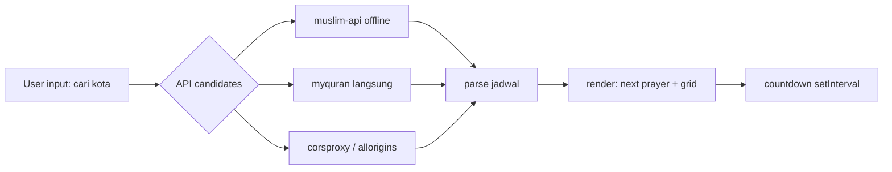

# JadwalSholat

- Frontend web statis untuk jadwal waktu sholat seluruh kab/kota di Indonesia
- Feed data dari `muslim-api` (offline) dengan fallback `myquran.com` + CORS proxy
- Tanpa build step dan tanpa dependency frontend; cukup disajikan sebagai file statis

## Structure of the Dir

| Dir | Description |
| :--- | :--- |
| `css/` | Stylesheet utama: token warna, layout, komponen, aksesibilitas |
| `js/` | Logika aplikasi: fetch API, combobox pencarian, render, musik |

## Description of Files

| File | Description | Cluster |
| :--- | :--- | :--- |
| `css/style.css` | Token `light-dark()`, layout, kartu, dialog, spinner | Styling |
| `index.html` | Markup semantik: landmark, `<search>`, `<dialog>`, ARIA | Markup |
| `js/script.js` | Logika app: API fallback, filter kota, render, countdown | Logic |
| `yaleel yaleel.mp3` | Nasheed lokal; pemutar pakai remote, ini cadangan | Audio |

## Description of Executables

- Tidak ada script executable; app seluruhnya berjalan di browser

## Description of Workflows

### Menjalankan secara lokal

- Serve folder sebagai static file lalu buka di browser:

```bash
> python3 -m http.server 8099 --bind 0.0.0.0
```

- Lalu akses `http://localhost:8099`

### Deploy ke server statis (nginx)

- Sync file ke root nginx lalu reload:

```bash
> sudo cp -r index.html css js /var/www/jadwalsholat/ \
    && sudo chown -R www-data:www-data /var/www/jadwalsholat
```

## Description of Architecture

- Semua logika hidup di `js/script.js` dengan alur satu arah:



- Modul logika di `js/script.js`:
  - API client: `apiFetch()` mencoba 4 kandidat URL berurutan sampai `res.ok`
  - Cache kota: `localStorage` kunci `jadwalsholat:kota:v2`,
    pola stale-while-revalidate
  - Pencarian: combobox ARIA lengkap (`aria-expanded`, `aria-activedescendant`),
    debounced 180ms, IME-safe (`event.isComposing`)
  - Render: satu fungsi `renderSchedule()` membangun `ul[role=list]` +
    `<time datetime>`; countdown hanya untuk "hari ini"
  - UX guard: skeleton anti-flash 250ms, `aria-busy`, race-guard `loadToken`
  - Musik: `<dialog>` native (`showModal`), pilihan disimpan di `sessionStorage`
- Styling di `css/style.css`:
  - Token warna via `light-dark()` + fallback `@media (prefers-color-scheme: dark)`
  - Aksesibilitas: `.skip-link`, `.visually-hidden`, `:focus-visible`,
    `prefers-reduced-motion` mematikan seluruh animasi
  - Komponen: kartu jadwal, dialog musik dengan `::backdrop`,
    spinner `conic-gradient`, skeleton shimmer
